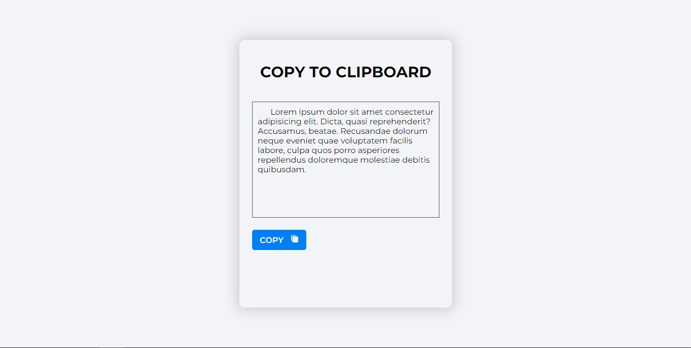

# Clipboard with Jquery

> this Jquery project is used to copy information from input.

## Built With

- HTML
- CSS
- JavaScript
- Jquery
## Live Demo

[Live Demo Link](https://dongomes.github.io/clipboard_jquery_edgar_29jul23)

## Getting Started
1. Clone this repo on your local machine

2. Open the index.html file in your browser.

3. Enjoy.

### Prerequisites
To make this repository working in your local machine you need only a browser.

## Author

👤 **Edgar Gomes**

- Github: [@dongomes](https://github.com/dongomes)
- Twitter: [@dongomes09](https://twitter.com/dongomes09)

## 🤝 Contributing

Contributions, issues and feature requests are welcome!

Feel free to check the [issues page](https://github.com/dongomes/clipboard_jquery_edgar_29jul23/issues).

## Show your support

Give a ⭐️ if you like this project!

## Acknowledgments

- Google: For letting us find crucial information in order to create this project.

## 📝 License

This project is [CC0-1.0](LIC ENSE) licensed.
